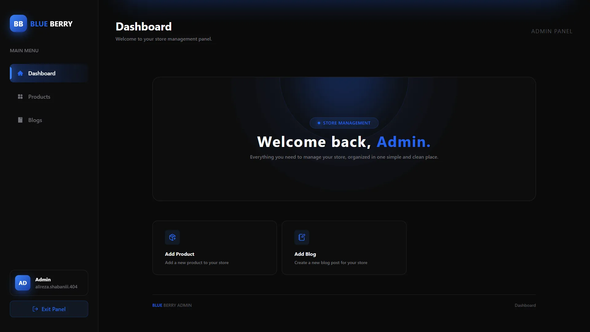
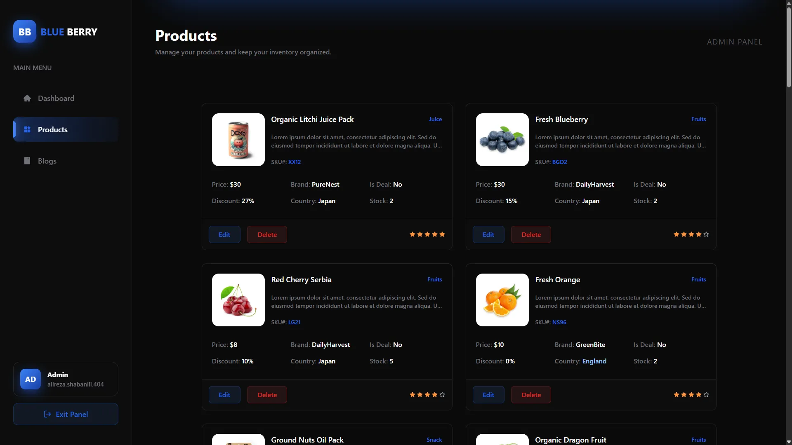
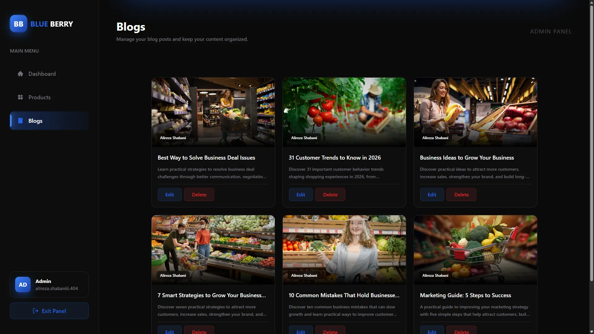

# 🫐 Blue Berry

**Blue Berry** is a modern and fully responsive **e-commerce application** built with **React** and **Vite**, integrated with **Supabase** for backend services and data management.

The project features a clean shopping experience with **English and German language support**, **Light and Dark themes**, product discovery, authentication, wishlist and cart functionality, blog pages, and a dedicated **Admin Dashboard**.

---

## ✨ Features

### 🛍️ Shopping Experience

- 🛒 Shopping cart
- ❤️ Wishlist
- 👀 Quick View
- 🔎 Product search
- 🏷️ Product filtering
- 🔗 Related products
- 📦 Single product pages
- 🛍️ Shop page
- 📱 Fully responsive design

### 🌍 Languages & Themes

- 🇬🇧 English
- 🇩🇪 German
- ☀️ Light Mode
- 🌙 Dark Mode
- 📱 Responsive Design

### 🔐 Authentication

- 🔑 Login
- 📝 Register
- 🚪 Logout
- 🔒 Authentication powered by Supabase

### 📰 Blog

- 📝 Blog page
- 📖 Single blog posts
- 🔎 Individual article viewing

### 📄 Additional Pages

- 🏠 Home
- 🛍️ Shop
- ❤️ Wishlist
- 🛒 Cart
- 📦 Product Details
- ⚡ Quick View
- 📰 Blog
- 📖 Single Blog
- ℹ️ About
- 📞 Contact
- ❓ FAQ

---

## 🛡️ Admin Dashboard

Blue Berry includes a **separate Admin Dashboard** for managing the application.

Dashboard access is **role-based**, allowing only users with an **admin role** to access the management panel.

---

## 🖼️ Screenshots

### Admin Dashboard

---

## 🛠️ Tech Stack

- **React**
- **Vite**
- **JavaScript**
- **Tailwind CSS**
- **Redux**
- **Supabase**
- **React Router**
- **Framer Motion**
- **GSAP**
- **i18next**
- **Responsive Design**
- **Dark Mode**

---

## 🌐 Live Demo

[**🫐 Blue Berry — Live Demo**](https://blue-berry-404.vercel.app/)

---

## 💙 Explore the Experience

Take a look around the store, switch between **Light & Dark Mode**, try both available languages, browse the products, and explore the different shopping features.

And when you're done...

**Don't forget to pay a little visit to the `404` page. 👀🫐**

---

## 👨‍💻 Author

**Alireza**

[**GitHub — Alireza-404**](https://github.com/Alireza-404)
